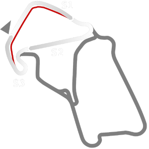

# 🏁 Track Info

---

---

## 📊 Specifications

- **Name**: Silverstone_2001
- **PitSpeedLimit_HighKPH**: 60
- **Max AI participants**: 35
- **Race_Date_Year**: 2001
- **Track_Climate**: England
- **Track Surface**: Tarmac
- **Track Type**: Circuit
- **Race_Date_Month**: 7
- **Race_Date_Day**: 15
- **TrackGradeFilter**: HistoricAlt
- **Number Of Turns**: 5
- **Track_TimeZone**: 0
- **Track_Altitude**: 154
- **Length**: 2638
- **DLC ID**: silverstonepack
- **Location**: England
