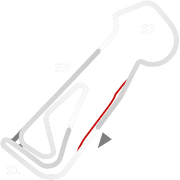
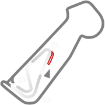

# 🏁 Track Info

Snetterton Circuitis a motor racing course in Norfolk, England, originally opened in 1953. The circuit is named after the nearby village of Snetterton to the north-west of the circuit. It is owned by Jonathan Palmer's MotorSport Vision organisation.[1]

---

---

