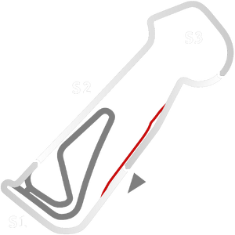

# 🏁 Track Info

---

---

## 📊 Specifications

- **Name**: Snetterton_200
- **PitSpeedLimit_HighKPH**: 60
- **Max AI participants**: 25
- **Race_Date_Year**: 2020
- **Track_Climate**: europe
- **Track Surface**: Tarmac
- **Track Type**: Circuit
- **Race_Date_Month**: 6
- **Race_Date_Day**: 22
- **TrackGradeFilter**: Grade2
- **Number Of Turns**: 8
- **Track_TimeZone**: 0
- **Track_Altitude**: 43
- **Length**: 3220
- **DLC ID**: 
- **Location**: England
