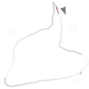

# 🏁 Track Info

TheCircuit de Spa-Francorchamps, informally referred to asSpa, is a 7.004 km (4.352 mi) motor-racing circuit located in Francorchamps, Stavelot, Wallonia, Belgium, about 8 km (5.0 mi) southeast of Spa.[1]

---

---

