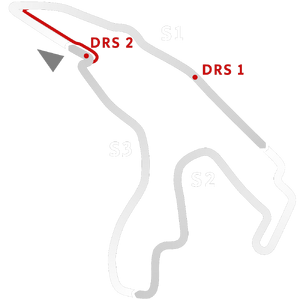

# 🏁 Track Info

---

---

## 📊 Specifications

- **Name**: Spa_Francorchamps_2022
- **PitSpeedLimit_HighKPH**: 60
- **Max AI participants**: 29
- **Race_Date_Year**: 2022
- **Track_Climate**: europe
- **Track Surface**: Tarmac
- **Track Type**: Circuit
- **Race_Date_Month**: 8
- **Race_Date_Day**: 27
- **TrackGradeFilter**: Grade1
- **Number Of Turns**: 20
- **Track_TimeZone**: 1
- **Track_Altitude**: 394
- **Is Clockwise**: TRUE
- **Length**: 7004
- **DLC ID**: spapack
- **Location**: Belgium
