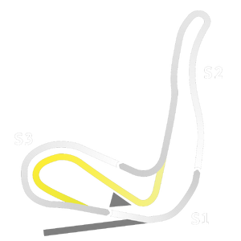

# 🏁 Track Info

---

---

## 📊 Specifications

- **Name**: Spa_Francorchamps_2022_RX
- **PitSpeedLimit_HighKPH**: 60
- **Max AI participants**: 5
- **Race_Date_Year**: 2022
- **Track_Climate**: Europe
- **Track Surface**: mud
- **Track Type**: Rallycross
- **Race_Date_Month**: 8
- **Race_Date_Day**: 27
- **TrackGradeFilter**: OffRoad
- **Number Of Turns**: 5
- **Track_TimeZone**: 1
- **Track_Altitude**: 394
- **Is Clockwise**: TRUE
- **Length**: 890
- **DLC ID**: adrenalinept1pack
- **Location**: Belgium
