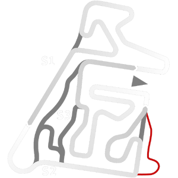

# 🏁 Track Info

---

---

## 📊 Specifications

- **Name**: Speedland2
- **PitSpeedLimit_HighKPH**: 60
- **Max AI participants**: 13
- **Race_Date_Year**: 2020
- **Track_Climate**: south_america
- **Track Surface**: Tarmac
- **Track Type**: Kart
- **Race_Date_Month**: 1
- **Race_Date_Day**: 30
- **TrackGradeFilter**: Kart
- **Number Of Turns**: 30
- **Track_TimeZone**: -3
- **Track_Altitude**: 700.188
- **Length**: 989
- **DLC ID**: 
- **Location**: Brazil
