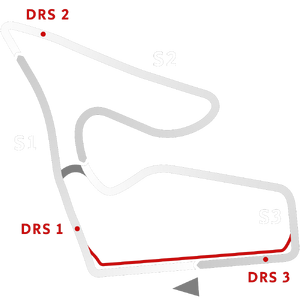

# 🏁 Track Info

---

---

## 📊 Specifications

- **Name**: Spielberg_Modern
- **PitSpeedLimit_HighKPH**: 60
- **Max AI participants**: 31
- **Race_Date_Year**: 2020
- **Track_Climate**: europe_farfog
- **Track Surface**: Tarmac
- **Track Type**: Circuit
- **Race_Date_Month**: 7
- **Race_Date_Day**: 5
- **TrackGradeFilter**: Grade1
- **Number Of Turns**: 10
- **Track_TimeZone**: 1
- **Track_Altitude**: 660
- **Is Clockwise**: TRUE
- **Length**: 4318
- **DLC ID**: 
- **Location**: Austria
