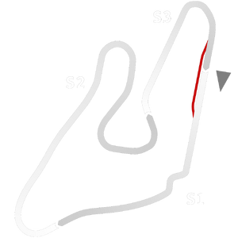

# 🏁 Track Info

---

---

## 📊 Specifications

- **Name**: Spielberg_Historic
- **PitSpeedLimit_HighKPH**: 60
- **Max AI participants**: 25
- **Race_Date_Year**: 1977
- **Track_Climate**: europe_farfog
- **Track Surface**: Tarmac
- **Track Type**: Circuit
- **Race_Date_Month**: 4
- **Race_Date_Day**: 22
- **TrackGradeFilter**: Historic
- **Number Of Turns**: 11
- **Track_TimeZone**: 1
- **Track_Altitude**: 660
- **Length**: 5916
- **DLC ID**: 
- **Location**: Austria
