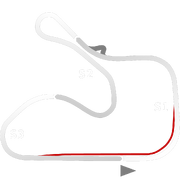
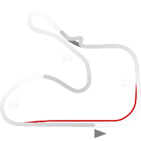

# 🏁 Track Info

Autódromo Internacional de Tarumãis a motorsports circuit located in Viamão, Rio Grande do Sul, Brazil. It hosts national championships such as Stock Car Pro Series and Copa Truck. Previously, it hosted the Brazilian Formula Renault, Formula 3 Sudamericana and Brazilian Formula 3 Championship.[1]

---

---

