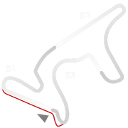

# 🏁 Track Info

Autódromo Termas de Río Hondois a 4.805 km (2.986 mi) motorsport circuit located in Termas de Río Hondo, Argentina. The circuit was opened in 2008 and underwent a complete overhaul and rebuild process in 2012, based on a design by the Italian circuit designer Jarno Zaffelli.[1]

---

---

