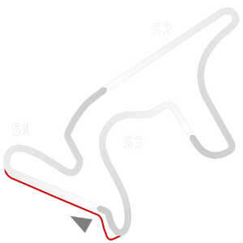

# 🏁 Track Info

---

---

## 📊 Specifications

- **Name**: Termas_Rio_Hondo
- **PitSpeedLimit_HighKPH**: 60
- **Max AI participants**: 33
- **Race_Date_Year**: 2022
- **Track_Climate**: south_america
- **Track Surface**: Tarmac
- **Track Type**: Circuit
- **Race_Date_Month**: 5
- **Race_Date_Day**: 29
- **TrackGradeFilter**: Grade2
- **Number Of Turns**: 14
- **Track_TimeZone**: -3
- **Track_Altitude**: 280.75
- **Is Clockwise**: TRUE
- **Length**: 4806
- **DLC ID**: 
- **Location**: Argentina
