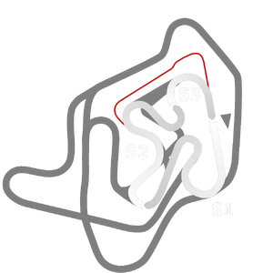

# 🏁 Track Info

---

---

## 📊 Specifications

- **Name**: Tykki_Tarmac
- **PitSpeedLimit_HighKPH**: 60
- **Max AI participants**: 15
- **Race_Date_Year**: 2022
- **Track_Climate**: Scandinavia_rx
- **Track Surface**: mud
- **Track Type**: Circuit
- **Race_Date_Month**: 5
- **Race_Date_Day**: 28
- **TrackGradeFilter**: OffRoad
- **Number Of Turns**: 7
- **Track_TimeZone**: 3
- **Track_Altitude**: 81
- **Length**: 750
- **DLC ID**: adrenalinept1pack
- **Location**: Finland
