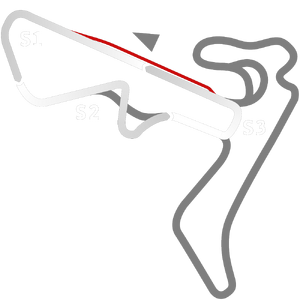

# 🏁 Track Info

---

---

## 📊 Specifications

- **Name**: VeloCittaClubDay
- **PitSpeedLimit_HighKPH**: 60
- **Max AI participants**: 33
- **Race_Date_Year**: 2020
- **Track_Climate**: south_america
- **Track Surface**: Tarmac
- **Track Type**: Circuit
- **Race_Date_Month**: 6
- **Race_Date_Day**: 28
- **TrackGradeFilter**: Alt
- **Number Of Turns**: 7
- **Track_TimeZone**: -3
- **Track_Altitude**: 750
- **Is Clockwise**: FALSE
- **Length**: 1721
- **DLC ID**: 
- **Location**: Brazil
