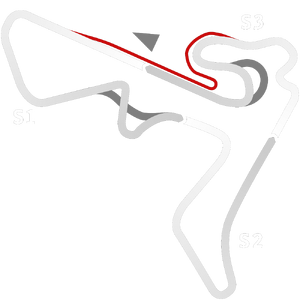

# 🏁 Track Info

---

---

## 📊 Specifications

- **Layout**: Velo Cittá Track Day
- **Pit speed limit(KPH)**: 60
- **Max AI participants**: 33
- **Default year**: 2020
- **Track Climate**: south_america
- **Track Surface**: Tarmac
- **Track Type**: Circuit
- **Default month**: 6
- **Default day**: 28
- **Grade**: Ungraded/Alternate
- **Number of turns**: 16
- **Track TimeZone**: -3
- **Altitude (Meter)**: 750
- **Is Clockwise**: FALSKT
- **Length (Meter)**: 3369
- **DLC**: 
- **Country**: Brazil
