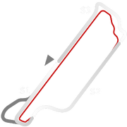
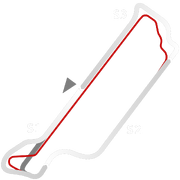
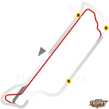

# 🏁 Track Info

TheVeloparkis a motorsport centre opened in 2008, located in the city of Nova Santa Rita, Rio Grande do Sul, Brazil. It was designed to have various layouts so that it could accommodate a wide variety of vehicles, such as karts, dragsters, open-wheel and touring cars.[1]

---

---

