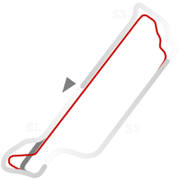

# 🏁 Track Info

---

---

## 📊 Specifications

- **Layout**: Velopark 2017
- **Pit speed limit(KPH)**: 60
- **Max AI participants**: 33
- **Default year**: 2020
- **Track Climate**: south_america
- **Track Surface**: Tarmac
- **Track Type**: Circuit
- **Default month**: 4
- **Default day**: 12
- **Grade**: Grade 3
- **Number of turns**: 13
- **Track TimeZone**: -3
- **Altitude (Meter)**: 15
- **Is Clockwise**: FALSKT
- **Length (Meter)**: 2278
- **DLC**: 
- **Country**: Brazil
