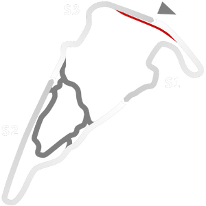

# 🏁 Track Info

---

---

## 📊 Specifications

- **Layout**: Virginia International Raceway  Full
- **Pit speed limit(KPH)**: 60
- **Max AI participants**: 27
- **Default year**: 2020
- **Track Climate**: north_usa
- **Track Surface**: Tarmac
- **Track Type**: Circuit
- **Default month**: 9
- **Default day**: 17
- **Grade**: Grade 2
- **Number of turns**: 18
- **Track TimeZone**: -5
- **Altitude (Meter)**: 65
- **Is Clockwise**: 
- **Length (Meter)**: 5262
- **DLC**: 
- **Country**: USA
