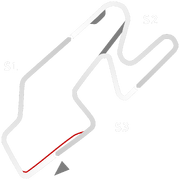
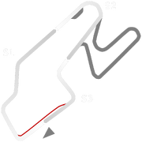
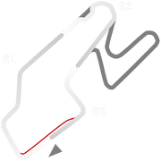
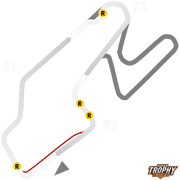

# 🏁 Track Info

Watkins Glen International, nicknamed "The Glen", is an automobile race track located in the town of Dix just southwest of the village of Watkins Glen, New York, at the southern tip of Seneca Lake. It was long known around the world as the home of the Formula One United States Grand Prix, which it hosted for twenty consecutive years (1961–1980).[1]

---

---

