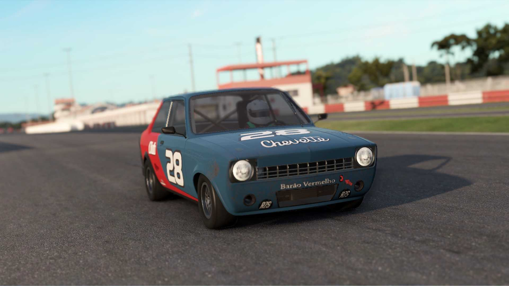

# 🚗 CHEVROLET CHEVETTE CCB

---

🛞 **Engine / Drive**: Front engine / Rear-wheel drive
🕰️ **Years Active**: 2011-2023  🏁 **Class**: Copa Classic - B Class

---

---

### 📋 Specifications

<table>
<tr><td><strong>Power</strong></td><td>92 kW 123 hp</td></tr>
<tr><td><strong>Torque</strong></td><td>125 Nm 92 ft/lb</td></tr>
<tr><td><strong>Weight</strong></td><td>900 kg 1985 lb</td></tr>
<tr><td><strong>Power to Weight</strong></td><td>0.137</td></tr>
<tr><td><strong>Engine</strong></td><td>1.6 L - G160/1 - NA</td></tr>
<tr><td><strong>Engine Layout</strong></td><td>Inline 4</td></tr>
<tr><td><strong>Aspiration</strong></td><td>Naturally aspirated</td></tr>
<tr><td><strong>BMEP</strong></td><td>980 kPa</td></tr>
<tr><td><strong>Shifter</strong></td><td>H-shifter</td></tr>
<tr><td><strong>Gears</strong></td><td>5</td></tr>
<tr><td><strong>Differential</strong></td><td>Fixed</td></tr>
<tr><td><strong>TC</strong></td><td>No</td></tr>
<tr><td><strong>ABS</strong></td><td>No</td></tr>
<tr><td><strong>Auto-blip</strong></td><td>No</td></tr>
<tr><td><strong>Shift Cut</strong></td><td>No</td></tr>
<tr><td><strong>Power Steering</strong></td><td>Yes</td></tr>
<tr><td><strong>ERS</strong></td><td>No</td></tr>
<tr><td><strong>Push to Pass</strong></td><td>No</td></tr>
<tr><td><strong>DRS</strong></td><td>No</td></tr>
<tr><td><strong>Adjustable boost</strong></td><td>No</td></tr>
<tr><td><strong>Onboard brake bias</strong></td><td>No</td></tr>
<tr><td><strong>Onboard anti-roll bar</strong></td><td>No</td></tr>
<tr><td><strong>Fuel capacity</strong></td><td>41 L</td></tr>
<tr><td><strong>Headlights</strong></td><td>Yes</td></tr>
<tr><td><strong>Pre-warmed tyres</strong></td><td>No</td></tr>
<tr><td><strong>Steering Wheel</strong></td><td>Round Medium/Large size</td></tr>
<tr><td><strong>Tyre Compounds</strong></td><td>Slick, Wet</td></tr>
</table>

---

## 🖼️ Gallery

---